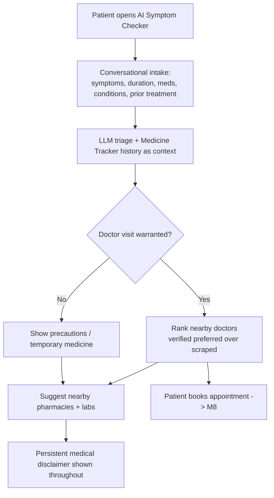
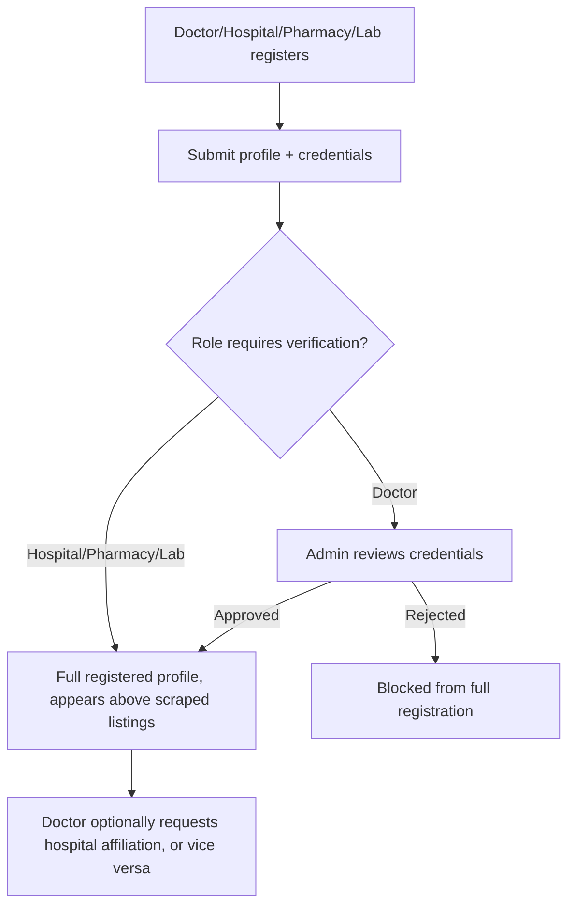
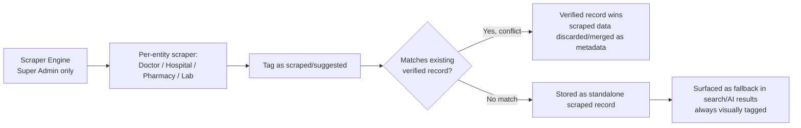
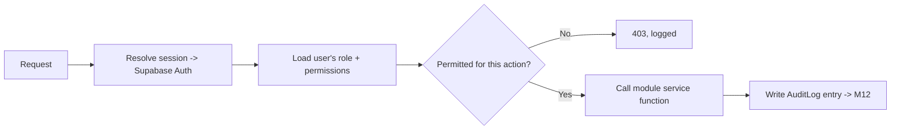

# Medicio — Architecture

> Translates the 12-module SRS into a buildable Next.js architecture, using your usual
> stack (Next.js, TypeScript, Tailwind CSS, PostgreSQL, Supabase, Prisma). Where the
> SRS left infrastructure choices open (§2.3), this document makes a concrete
> recommendation — flagged as **[Recommendation]** — rather than leaving a gap.

## 1. Shape of the system

The SRS explicitly wants modules "designed for independent development and deployment,
communicating through well-defined internal interfaces" (§2.1) but doesn't mandate
microservices — and for an FYP-scoped build, a **modular monolith** gets you that
separation without the operational overhead of running 12 services.

**[Recommendation]** One Next.js (App Router) application. Each SRS module (M1–M12)
becomes a `modules/<name>` domain package with its own service functions, types, and
Prisma model ownership. Route handlers and Server Actions are thin — they validate
input, check permissions, and call into a module's service layer. Nothing reaches
another module's Prisma models directly except through that module's exported
functions.

This keeps the RBAC-everywhere rule (FR-IAM-05: "no module may implement a parallel
authorization path") easy to enforce, because there's exactly one place auth checks
live (`lib/auth`), and every module goes through it.

## 2. Tech stack

| Layer | Choice | Why |
| --- | --- | --- |
| Framework | Next.js (App Router), TypeScript | Your default stack; Server Actions + Route Handlers cover both UI-driven mutations and external endpoints (POS sync, scraper triggers) |
| Styling | Tailwind CSS | Your default; role-scoped dashboards (NFR-USE-01) are mostly layout variants of shared components |
| Database | PostgreSQL via Supabase | Your default; Supabase gives you Postgres + Auth + Storage + pgvector/PostGIS in one project |
| ORM | Prisma | Your default; schema.prisma becomes the literal implementation of SRS §7's conceptual data model |
| Auth | Supabase Auth | Already in the stack via Supabase — avoids running a second auth system. RBAC role/permission resolution still lives in your own `users`/`roles` tables, checked server-side per FR-IAM-05, not just Supabase's built-in policies |
| Geospatial | PostGIS (Supabase extension) | NFR-SCALE-02 requires indexed radius queries for doctor/pharmacy/lab search — plain lat/lng columns won't scale past a few thousand rows |
| AI / LLM | Vercel AI SDK + a chosen provider (OpenAI, Anthropic, etc.) | Streaming responses for the symptom-checker chat UI; provider swap stays a config change, not a rewrite — **[Open]** which provider, per SRS §8 |
| Background jobs | Supabase Edge Functions (scheduled) or a hosted queue (e.g. Inngest, trigger.dev) | NFR-PERF-03 requires scraper jobs to run async and not block user requests; Vercel serverless functions can't run long background workers themselves |
| Analytics | PostHog (posthog-js client, posthog-node server) | Named explicitly in FR-LOG-03 |
| Validation | Zod | Shared schema between client forms and server-side validation |
| Testing | Vitest (unit/integration) + Playwright (e2e) | — |

## 3. App flow

### 3.1 Primary patient flow — symptom check to outcome



### 3.2 Provider onboarding flow



### 3.3 Scraped-data reconciliation



### 3.4 Request-time RBAC

Every protected Server Action / Route Handler follows the same shape — this is what
makes FR-IAM-05 and NFR-SEC-02 true in practice, not just on paper:



## 4. Folder & file structure

```
medicio/
├─ prisma/
│  ├─ schema.prisma            # implements SRS §7 conceptual data model
│  └─ migrations/
├─ src/
│  ├─ app/
│  │  ├─ (public)/             # landing, login, register
│  │  ├─ (patient)/            # symptom-checker, agents, booking, tracker, portal
│  │  ├─ (provider)/           # doctor/hospital/pharmacy/lab dashboards
│  │  ├─ (admin)/              # verification queue, scraper config, logs, analytics
│  │  ├─ api/
│  │  │  ├─ ai/                # symptom checker + specialty agent endpoints (streaming)
│  │  │  ├─ doctors/
│  │  │  ├─ hospitals/
│  │  │  ├─ pharmacies/
│  │  │  ├─ labs/
│  │  │  ├─ appointments/
│  │  │  ├─ medicine-tracker/
│  │  │  ├─ portal/
│  │  │  ├─ scraper/           # Super Admin only, checked server-side
│  │  │  └─ webhooks/          # POS sync callbacks
│  │  └─ layout.tsx
│  ├─ modules/                 # one folder per SRS module, owns its Prisma models
│  │  ├─ iam/                  # M1 — session, role resolution, RBAC rules
│  │  ├─ symptom-checker/      # M2
│  │  ├─ specialty-agents/     # M3
│  │  ├─ doctors/              # M4
│  │  ├─ hospitals/            # M5
│  │  ├─ pharmacies/           # M6
│  │  ├─ labs/                 # M7
│  │  ├─ appointments/         # M8
│  │  ├─ medicine-tracker/     # M9
│  │  ├─ patient-portal/       # M10
│  │  ├─ scraper/              # M11 — per-entity adapters live here
│  │  │  └─ adapters/
│  │  └─ analytics/            # M12
│  ├─ components/
│  │  ├─ ui/                   # shared design-system primitives
│  │  ├─ patient/
│  │  ├─ provider/
│  │  └─ admin/
│  ├─ lib/
│  │  ├─ auth/                 # the one place permission checks live
│  │  ├─ prisma.ts
│  │  ├─ ai/                   # LLM client, prompt templates, agent scope guards
│  │  ├─ posthog.ts
│  │  ├─ geo.ts                # PostGIS query helpers
│  │  └─ validation/           # zod schemas, shared client+server
│  ├─ middleware.ts            # route-group gating by role
│  └─ types/
├─ .env.example
├─ next.config.ts
├─ tailwind.config.ts
└─ package.json
```

Each `modules/<name>/` folder holds: `service.ts` (business logic, called by routes/
actions), `schema.ts` (zod input/output shapes), and its slice of `prisma/schema.prisma`
models. Cross-module calls go through another module's `service.ts` export — never
through its Prisma models directly.

## 5. Data model notes

SRS §7's conceptual entities (User, Role/Permission, Doctor, Hospital, Pharmacy, Lab,
ScrapedRecord, Appointment, MedicineTrackerEntry, LabReport, AIConsultation,
AgentConversation, InventoryItem, AuditLog, AnalyticsEvent) map fairly directly to
Prisma models. Two things worth deciding early since they shape the schema:

- **Verified vs. scraped**: rather than a separate `ScrapedRecord` table per entity
  type, consider a shared `source: VERIFIED | SCRAPED` enum + `verifiedRecordId`
  nullable FK on Doctor/Hospital/Pharmacy/Lab themselves, so search queries don't need
  to union two tables per entity type. Either approach satisfies FR-SCRAPE-05/06 — pick
  one before the scraper module (M11) is built, since it's expensive to change later.
- **Custom roles**: FR-IAM-04 implies permissions need to be data-driven, not hardcoded
  enums — a `Role` + `Permission` + join table, not a single `role: string` column on
  `User`.

## 6. Module dependency order

Pulled from each module's "Dependencies" field in the SRS — this is the real build
order constraint, and it's what `Process.md` phases are sequenced against:

```
M1 (IAM/RBAC) — depended on by everything, build first
  └─ M4 Doctor, M5 Hospital, M6 Pharmacy, M7 Lab
        └─ M8 Appointment Booking (needs M4)
        └─ M11 Scraper (feeds M4–M7 as fallback data)
  └─ M9 Medicine Tracker
        └─ M2 Symptom Checker (needs M4, M6, M7, M9, M11)
              └─ M3 Specialty Agents (needs M4, M8, M7)
  └─ M10 Patient Portal (needs M7, M8, M9, M2, M3)
  └─ M12 Analytics/Logging (receives events from all modules — wire incrementally)
```
