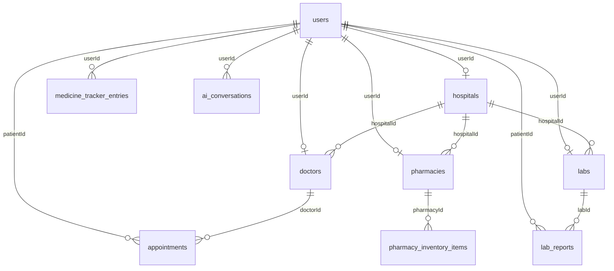

# Medicio Database Schema Specification

This document details the relational PostgreSQL database schema managed by Prisma ORM for the Medicio platform.

---

## Prisma Models & Relations

### 1. User (`users`)
Represents registered credentials and profile information. Supports role-based access control.
- `id` (String, PK, CUID)
- `email` (String, Unique)
- `passwordHash` (String)
- `name` (String)
- `role` (UserRole: PATIENT, DOCTOR, HOSPITAL_ADMIN, LAB_ADMIN, PHARMACY_ADMIN, ADMIN, SUPER_ADMIN)
- `createdAt` (DateTime)
- `updatedAt` (DateTime)

### 2. Doctor (`doctors`)
Represents verified medical practitioners.
- `id` (String, PK, CUID)
- `userId` (String, Unique, FK -> User)
- `specialty` (String)
- `education` (String)
- `experience` (Int)
- `licenseNumber` (String)
- `isVerified` (Boolean)
- `availability` (String, JSON)
- `hospitalId` (String, Nullable, FK -> Hospital)
- `createdAt` (DateTime)
- `updatedAt` (DateTime)

### 3. Hospital (`hospitals`)
Represents clinical facilities.
- `id` (String, PK, CUID)
- `userId` (String, Nullable, Unique, FK -> User)
- `name` (String)
- `location` (String)
- `facilities` (String)
- `isVerified` (Boolean)
- `createdAt` (DateTime)
- `updatedAt` (DateTime)

### 4. Pharmacy (`pharmacies`)
Represents verified pharmacy outlets.
- `id` (String, PK, CUID)
- `userId` (String, Nullable, Unique, FK -> User)
- `hospitalId` (String, Nullable, FK -> Hospital)
- `name` (String)
- `location` (String)
- `isVerified` (Boolean)
- `createdAt` (DateTime)
- `updatedAt` (DateTime)

### 5. PharmacyInventoryItem (`pharmacy_inventory_items`)
Represents stocks linked/manually loaded from pharmacies.
- `id` (String, PK, CUID)
- `pharmacyId` (String, FK -> Pharmacy)
- `name` (String)
- `price` (Float)
- `stock` (Int)
- `lastSync` (DateTime)

### 6. Lab (`labs`)
Represents verified medical diagnostic facilities.
- `id` (String, PK, CUID)
- `userId` (String, Nullable, Unique, FK -> User)
- `hospitalId` (String, Nullable, FK -> Hospital)
- `name` (String)
- `isVerified` (Boolean)
- `createdAt` (DateTime)
- `updatedAt` (DateTime)

### 7. LabReport (`lab_reports`)
Represents uploaded test findings linked to patients.
- `id` (String, PK, CUID)
- `patientId` (String, FK -> User)
- `labId` (String, FK -> Lab)
- `testName` (String)
- `resultData` (String, JSON/Text)
- `fileUrl` (String, Nullable)
- `createdAt` (DateTime)
- `updatedAt` (DateTime)

### 8. Appointment (`appointments`)
Represents booking schedules.
- `id` (String, PK, CUID)
- `patientId` (String, FK -> User)
- `doctorId` (String, FK -> Doctor)
- `dateTime` (DateTime)
- `status` (String: PENDING, CONFIRMED, CANCELLED, COMPLETED)
- `notes` (String, Nullable)
- `createdAt` (DateTime)
- `updatedAt` (DateTime)

### 9. MedicineTrackerEntry (`medicine_tracker_entries`)
Represents patient-disclosed active medicines.
- `id` (String, PK, CUID)
- `userId` (String, FK -> User)
- `medicineName` (String)
- `dosage` (String)
- `frequency` (String)
- `startDate` (DateTime)
- `endDate` (DateTime, Nullable)
- `createdAt` (DateTime)
- `updatedAt` (DateTime)

### 10. ScrapedRecord (`scraped_records`)
Temporary cache of aggregated unverified public medical listings.
- `id` (String, PK, CUID)
- `entityType` (String: DOCTOR, HOSPITAL, PHARMACY, LAB)
- `name` (String)
- `contactInfo` (String, Nullable)
- `location` (String, Nullable)
- `rawDetails` (String, JSON)
- `lastScraped` (DateTime)

### 11. AIConversation (`ai_conversations`)
Auditable logging of LLM symptom triage and bot sessions.
- `id` (String, PK, CUID)
- `userId` (String, Nullable, FK -> User)
- `conversationType` (String: SYMPTOM_CHECKER, SPECIALTY_AGENT)
- `messages` (String, JSON)
- `createdAt` (DateTime)
