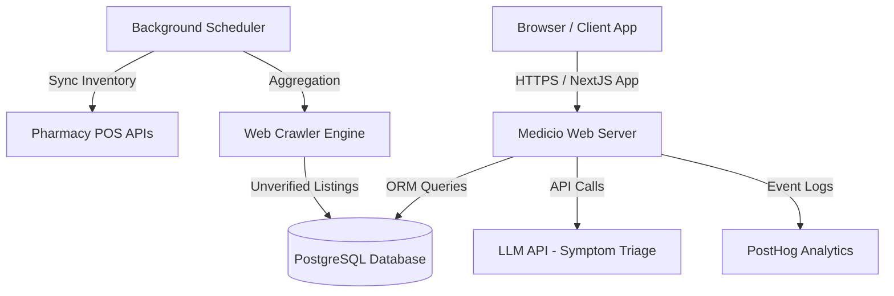

# Medicio Technical Requirements Document (TRD)

This document defines the high-level system architecture, boundaries, technology stack, and security integrations for Medicio.

---

## System Architecture



Medicio utilizes a modular architecture with three main tiers:
1. **Client Tier**: Responsive web app styled using HeroUI v3 components and Tailwind CSS v4.
2. **Application Tier**: Next.js 16 Server-Side API Handlers executing business logic and querying the LLM provider.
3. **Database Tier**: Relational PostgreSQL database managed with Prisma ORM.

---

## Detailed Tech Stack

- **Framework**: Next.js 16 (App Router with Turbopack optimization)
- **Language**: TypeScript
- **Styling**: Tailwind CSS v4, HeroUI v3 (NextUI rebranded)
- **Database ORM**: Prisma Client
- **Database Engine**: PostgreSQL
- **AI Integrations**: LLM Provider API (e.g. Gemini 1.5 Pro / OpenAI GPT-4o)
- **Analytics Tracking**: PostHog SDK (client-side and server-side events)

---

## Critical Data Flow Processes

### 1. Patient AI Symptom Triage
```
Patient User
  └── Inputs symptoms (natural language + pre-existing conditions)
        └── Server checks user history & medicine tracker
              └── Sends prompt with strict medical system disclaimer to LLM
                    └── LLM returns severity index, condition lists, and referral specialty
                          └── Server fetches nearby registered and scraped doctors of that specialty
                                └── Patient views advice, bookings, and pharmacies
```

### 2. POS Inventory Cadence Sync
```
Hourly Scheduler
  └── Queries registered Pharmacy inventory parameters
        └── Translates POS schemas via target adapters
              └── Updates PharmacyInventoryItem table (SKU, Price, Count)
```

---

## Security, Privacy & Compliance

- **Medical Disclaimers**: Displayed persistently on all symptom check logs. Clarifies that AI triage is advisory and does not replace a clinical consultation.
- **Access Authorization**: Enforced server-side for every route via JWT session RBAC tokens.
- **HIPAA & GDPR Guidelines**: Patient data must be encrypted at rest and in transit. Strict audit logging tracks all database write operations.
- **Accessibility standards**: Fully compliant with WCAG 2.1 AA guidelines, utilizing keyboard navigation helpers and screen-reader tags (ARIA) built into HeroUI.
